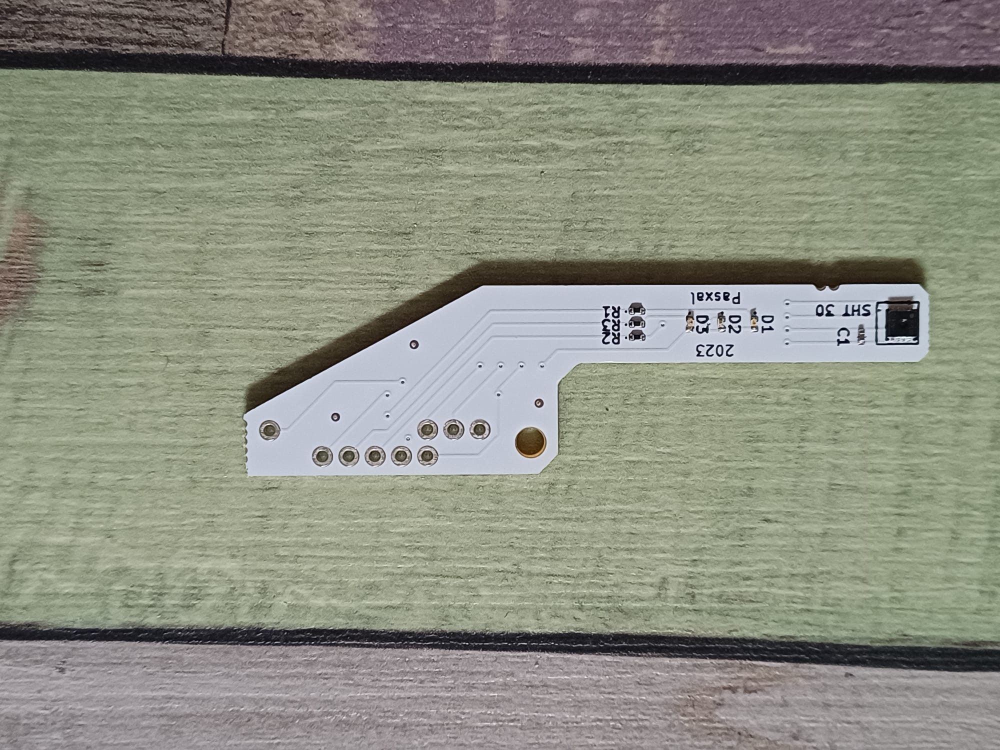

This repo contains everything to build a system for monitoring temperature and humidity in a building.
Dedicated sensors are built to measure and send the data via Http API to a host server.
The collected data is stored and visualized with a web interface.

## Sensor design

The Sensor is based on the SHT30 IC from Sensiron, a digital temperature and humidity sensor.
https://sensirion.com/products/catalog/SHT30-DIS-B

A custom PCB was designed to read the sensor from a raspberry zero w.

SHT30 dongle:




## Sensor Software

The sensor is read via the I2C bus using a python script.  
The dongle features 3 status LED (red, green and orange).  
A systemd service and timer unit are logging the data as a separated, dedicated system user (mydongle).  
Data is written to a sambda drive, then copyed to local NAS an visualized using a webserver (other project).


## Usage

Copy `SHT30_software` and `setup.sh` to your Raspberry with attached dongle.  
Run `chmod +X setup.sh`, then `sudo ./setup.sh` to finish installation.
The device will start logging climatic data.  
Verify the running service:  
`systemctl status mydongle.service` or `systemctl status mydongle.timer`  

```
{"time": "Mon Feb 24 11:22:41 2025", "temperature": 14.16, "humidity": 59.68, "timestamp": 1740392561.3886838, "hostname": "cellar"}
```
That's it.

---
written by P4sxal 2024-2025
